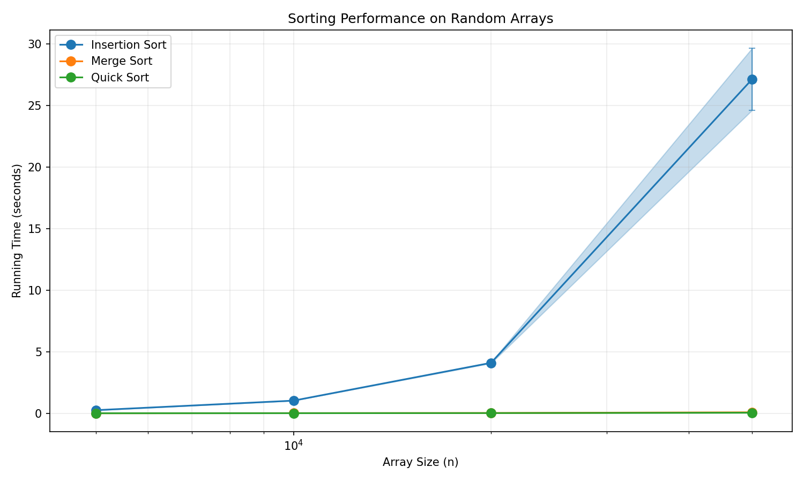
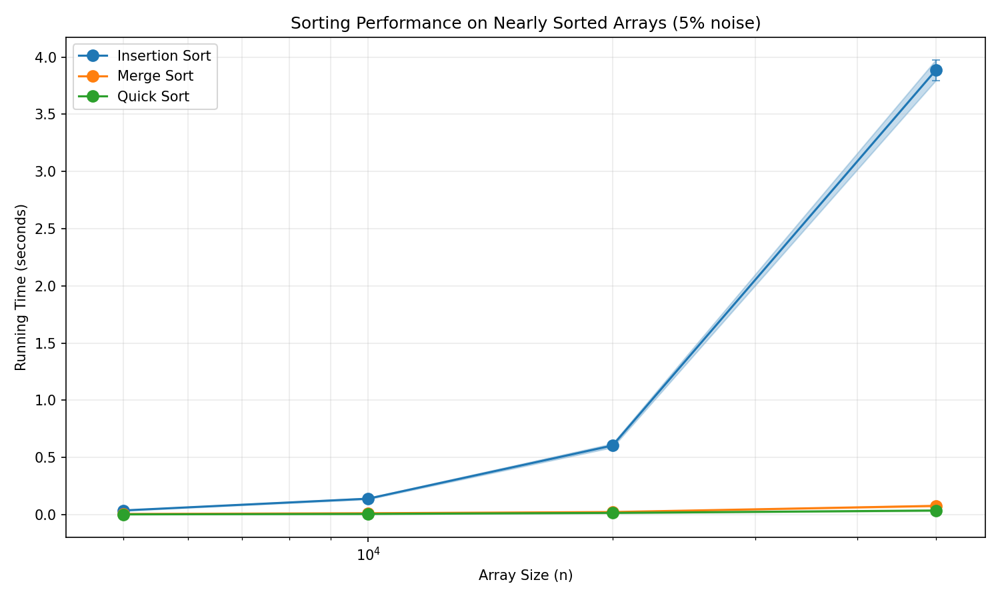

# Sorting_Assignment

## Student Name:
- Yoav Hamburger

## Selected Algorithms
Per the assignment list, this submission implements and compares:
- **3** – Insertion Sort  
- **4** – Merge Sort  
- **5** – Quick Sort  

(The course handout maps IDs 1–5 to Bubble, Selection, Insertion, Merge, and Quick; only the three above are implemented here.)

## How To Run

Recommended (uses built-in sizes **5,000 … 1,000,000** — omit `-s` so the x-axis is not stuck on small `n`):

`py run_experiments.py -a 3 4 5 -e 1 -r 10`

Assignment-style example with explicit sizes (must include large `n` if you want a wide x-axis):

`python run_experiments.py -a 3 4 5 -s 5000 10000 50000 100000 -e 1 -r 20`

If you use only small sizes (e.g. `-s 100 500 1000`), the plot will only span that range.

CLI:
- **`-a`** – exactly three algorithm IDs (here: `3`, `4`, `5`)
- **`-s`** – array sizes (optional; default starts at **5,000** and goes up to **1,000,000**)
- **`-e`** – `1` = nearly sorted with **5%** random swaps, `2` = **20%**
- **`-r`** – repetitions per size

Outputs: **`result1.png`** (random arrays), **`result2.png`** (nearly sorted with noise).

## Result 1 - Random Arrays

Insertion Sort grows much faster than Merge Sort and Quick Sort as `n` increases, which matches expected time complexity behavior (`O(n^2)` vs `O(n log n)`).  
Merge Sort and Quick Sort remain significantly faster and scale better for larger inputs.

## Result 2 - Nearly Sorted Arrays

For **result2**, running times change versus **result1** because the input starts sorted and is only partially perturbed (random swaps at the chosen noise level). Insertion Sort improves the most on nearly sorted data because it makes fewer shifts when the sequence is already close to order. Merge Sort and Quick Sort still perform well; the relative gaps between algorithms narrow compared to fully random inputs.
